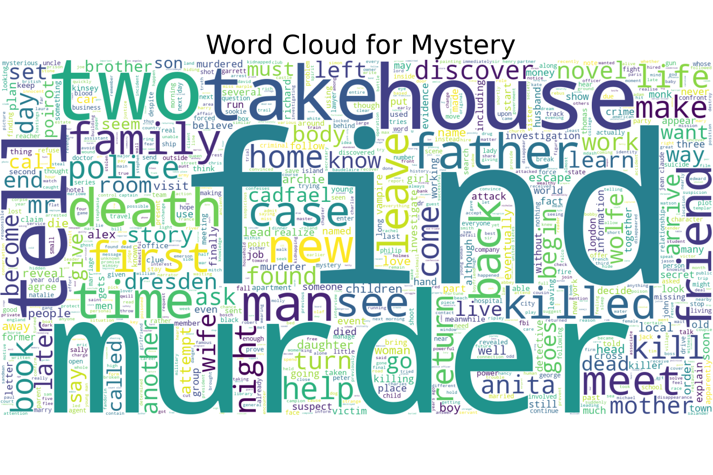
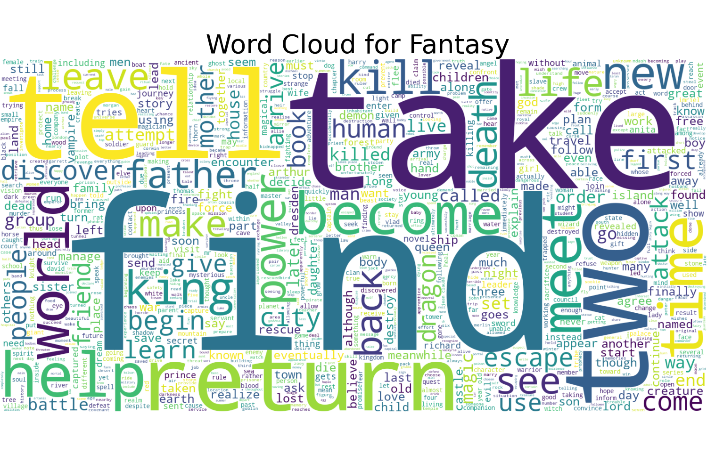

# Project-4

# Introduction #
Our objective for this project was to train and evaluate various machine learning models to determine which deep learning model could effectively learn and predict a book's genre based on its plot summary. Using several supervised machine learning models (below), we effectively tested and trained a database of 16K book titles to predict book genres.

# Project Data Sources #
- Kaggle Dataset of Carnegie Mellon University book summaries - https://www.cs.cmu.edu/~dbamman/booksummaries.html
          

- CoPilot Resources
  
- ChatGPT forums
  
- Project Inspiration from Shweta S. Enterprise Solutions Architect
  
  # Data Cleaning#
The first step is to understand the data and make it adequate for our neural network.
- Create Dataframe: Read in from the text file which contains all the book summaries, genre, author, book title, etc. and visualize the data and save it to a dataframe.
- Delete all the rows where the values for genre and summary are empty because these rows won't be any use for us.
- Genres: There are also multilabel genre labels for each book. We will take into account only one label. To do so, a study was done to see which genres are the more frequent ones and discard those that aren't.
  

- We also analyzed the text summaries. To make the text more suitable for our model, we have to remove "stopwords"
 (e.g. i,me,my,myself,we,our,ours,ourselves,you,your,yours,a,an,the,and,but,if,or,because,as)  

- We also got rid of periods and punctuation as these won't be of any use to the neural network.
 

- We turned all strings to lowercase.

# Data Analysis #
- Text as Data model used to understand the word frequency and the similarities between genre classification. Across the seven genres we worked with, the most common work found was "find"

# Models
1. BERT (Bidirectional Encoder Representations from Transformers):
    - Concept: BERT is a type of deep learning model that is specifically designed for natural language processing (NLP) tasks. It uses a Transformer architecture, which allows it to understand the context of words in a sentence by considering both the left and right context simultaneously.
    - Features: BERT is pre-trained on large amounts of text data and can be fine-tuned for specific tasks with smaller datasets. It has achieved state-of-the-art results on many NLP benchmarks.
    - Process: BERT tokenizes text into subwords or word pieces, and then embeds each token into a high-dimensional vector space using pre-trained word embeddings. These embeddings are then processed through multiple layers of Transformer blocks to capture contextual information. The final hidden states of certain tokens or the pooled output are used as features for downstream tasks.
    - Libraries:
        - transformers (formerly known as pytorch-transformers): This library provides pre-trained BERT models and tokenizers for both PyTorch and TensorFlow.
        - tensorflow or torch: Depending on the implementation, you'll use TensorFlow or PyTorch to work with BERT models.
3. LSTM (Long Short-Term Memory):
    - Concept: LSTM is a type of recurrent neural network (RNN) architecture that is designed to capture long-term dependencies in sequential data. It has a memory cell that can store information over time, allowing it to learn patterns in sequential data.
    - Process: LSTM processes text by tokenizing it into words or characters, converting each token into a numerical representation (e.g., word embeddings), and then feeding these representations into the LSTM cells. The LSTM cells use their internal memory mechanisms to capture dependencies and patterns in sequential data.
    - Libraries:
        - tensorflow or torch: Both TensorFlow and PyTorch provide implementations of LSTM cells and layers for building recurrent neural networks.
        - keras: If using TensorFlow, you can also use the Keras API, which provides a high-level interface for building neural networks, including LSTM models.
4. SVC (Support Vector Classifier):
    - Concept: SVC is a type of supervised learning algorithm that is used for classification tasks. It works by finding the hyperplane that best separates different classes in the feature space. It is like a boundary setter that draws lines to separate different groups of data points in space.
    - Features: SVC is effective in high-dimensional spaces and is robust to overfitting when the number of features is greater than the number of samples.
    - Process: SVC doesn't directly convert text into numerical data like neural network models. Instead, text data needs to be pre-processed and transformed into numerical features (e.g., bag-of-words representation or TF-IDF vectors) using techniques like tokenization and vectorization. These numerical features are then fed into the SVC model for training and prediction.
    - Libraries:
        - scikit-learn: This library provides implementations of SVC and various text preprocessing tools such as CountVectorizer and TfidfVectorizer for converting text data into numerical features.
5. Logistic Regression:
    - Concept: Logistic regression is a type of linear regression model that is used for binary classification tasks. It models the probability that a given input belongs to a particular class using a logistic function.
    - Process: Similar to SVC, logistic regression requires text data to be pre-processed and transformed into numerical features using techniques like tokenization and vectorization. The numerical features are then used as input to the logistic regression model, which learns to predict the probability of each class.
    - Libraries:
        - scikit-learn: You can use the LogisticRegression class from scikit-learn for building logistic regression models. Pre-processing tools like CountVectorizer or TfidfVectorizer can also be used for text data transformation.
6. Naive Bayes:
    - Concept: Naive Bayes is a probabilistic classification algorithm based on Bayes' theorem with an assumption of independence between features. It calculates the probability of each class given a set of input features and selects the class with the highest probability.
    - Process: Naive Bayes classifiers work directly with text data represented as bag-of-words or TF-IDF vectors. Text data is pre-processed and converted into numerical features using techniques like tokenization and vectorization. These features are then used as input to the Naive Bayes classifier, which calculates class probabilities based on Bayes' theorem.
    - Libraries:
        - scikit-learn: This library provides implementations of various Naive Bayes classifiers such as MultinomialNB and BernoulliNB, along with pre-processing tools like CountVectorizer and TfidfVectorizer.
7. XGBoost (Extreme Gradient Boosting):
    - Concept: XGBoost is a type of gradient boosting algorithm that builds an ensemble of weak learners (decision trees) sequentially, where each tree corrects the errors of its predecessor. It uses a gradient descent optimization technique to minimize a loss function. It is like a team of players who work together to solve a problem by learning from each other's mistakes and improving over time.
    - Features: XGBoost is widely used in structured/tabular data. XGBoost is highly scalable, efficient, and provides excellent predictive performance. It can handle missing values, automatically handles feature interactions, and is resistant to overfitting.
    - Process: XGBoost operates on structured/tabular data, so text data needs to be pre-processed and converted into numerical features using techniques like bag-of-words or TF-IDF representation. Once the text data is transformed into numerical features, these features are used as input to the XGBoost model, which builds an ensemble of decision trees to make predictions.
    - Libraries:
        - xgboost: This library provides an efficient and scalable implementation of gradient boosting algorithms, including XGBoost. Pre-processing tools like CountVectorizer or TfidfVectorizer from scikit-learn can be used for text data transformation.

In summary, while neural network models like BERT and LSTM have built-in mechanisms to process and learn from raw text data, traditional machine learning models like SVC, logistic regression, Naive Bayes, and XGBoost require pre-processing and transformation of text data into numerical features before training the models. Each approach has its advantages and is suitable for different types of text data and tasks.

  # Training, Validation and Test#
- The test and training groups were split 20/80.

- Feature Extraction - For all the models, TFIDF vectors have been used and the classifier used is the OneVsRestClassifier from the sklearn library.

